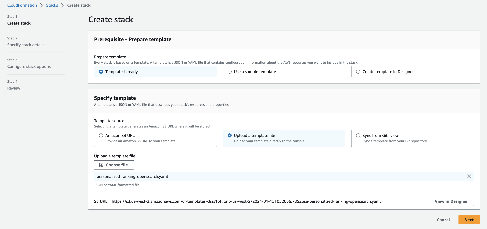
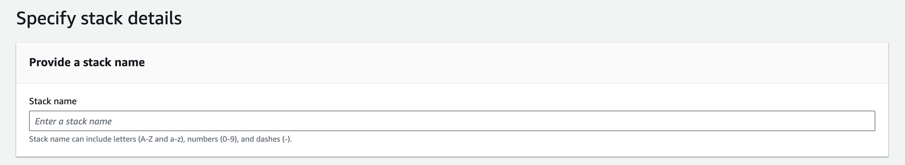
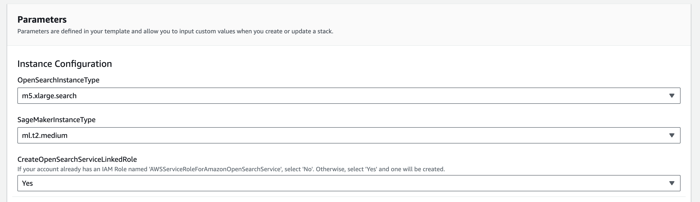
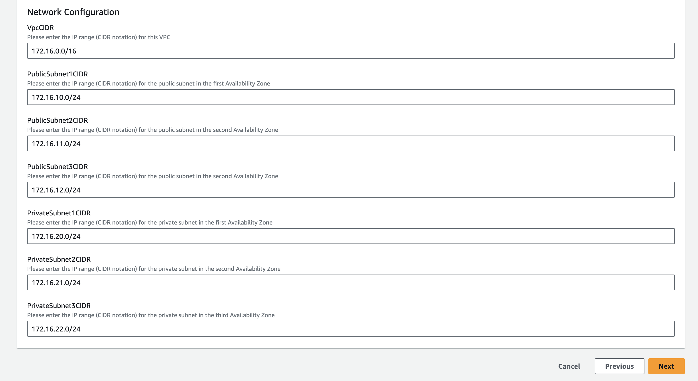
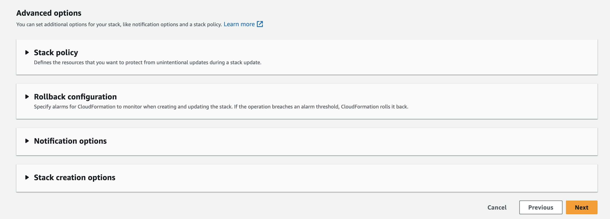
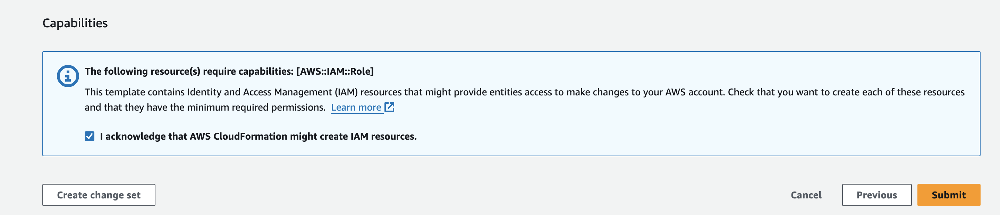
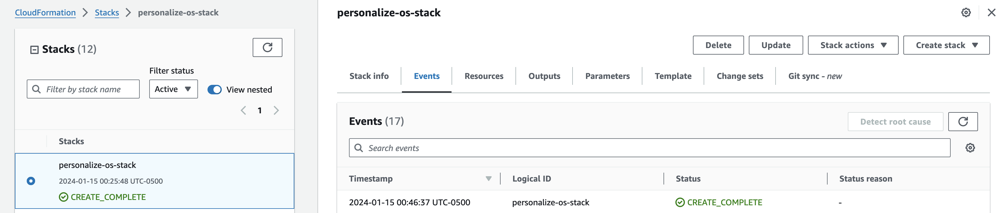
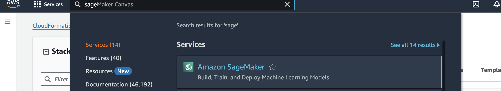
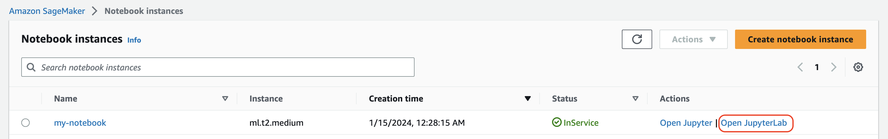

## **Amazon Personalize와 Amazon OpenSearch Service를 활용한 AI 기반 개인화 경험 구현**

[OpenSearch](https://opensearch.org/)는 시맨틱 검색, 로그 분석, 보안 모니터링 및 관찰 가능성 애플리케이션을 위한 확장 가능하고 유연하며 확장 가능한 오픈 소스 소프트웨어 제품군으로, Apache 2.0 라이선스로 제공됩니다. Amazon OpenSearch Service는 AWS 클라우드에서 OpenSearch를 쉽게 배포, 확장 및 운영할 수 있게 해주는 완전 관리형 서비스입니다.

[Amazon Personalize](https://aws.amazon.com/personalize/)를 사용하면 Amazon.com에서 20년 이상 사용해온 동일한 기계 학습(ML) 기술을 활용하여 애플리케이션에 정교한 개인화 기능을 쉽게 추가할 수 있습니다. ML 전문 지식이 필요하지 않습니다.

이 리포지토리는 Amazon Personalize 및 Amazon OpenSearch 리소스를 배포하고 [Amazon Opensearch용 개인화 검색 플러그인](https://aws.amazon.com/blogs/machine-learning/personalize-your-search-results-with-amazon-personalize-and-amazon-opensearch-service-integration/)을 구성하는 데 도움이 되는 코드를 포함하고 있습니다. 이를 통해 사용자의 상호 작용 기록과 관심사를 활용하여 검색 결과를 향상시킬 수 있습니다.

**데이터셋:**

MovieLens + IMDb 데이터셋

**참고:**
> IMDb 데이터 사용은 AWS 워크샵 및/또는 튜토리얼을 완료하는 목적으로만 제한됩니다. AWS 워크샵 및/또는 튜토리얼 외부에서 IMDb 데이터를 사용하려면 IMDb의 데이터 라이선스가 필요합니다. 데이터 라이선스를 얻으려면 다음 연락처로 문의하세요: imdb-licensing-support@imdb.com.

### 목표

독자들은 OpenSearch용 Personalize 플러그인을 배포하고 구성하는 방법을 배울 수 있으며, 이를 통해 사용자 기반의 개인화된 검색 결과를 제공할 수 있습니다. 또한 개인화 가중치를 조정할 때 검색 결과가 어떻게 달라지는지 배울 수 있습니다.

### 프로세스

1. 작업 환경 배포 [아래 참조]
2. Amazon Personalize 구성 - 1.Configure_Amazon_Personalize.ipynb
3. Amazon OpensSearch 구성 - 2.Configure_Amazon_OpenSearch.ipynb
4. Personalize 플러그인 테스트 - 3.Testing.ipynb
5. 정리 - 4.Clean_Up.ipynb

### 작업 환경 배포

위에서 언급한 대로 첫 번째 단계는 초기 설정 작업의 대부분을 수행할 CloudFormation 템플릿을 배포하는 것입니다. 다른 브라우저 창이나 탭에서 AWS 계정에 로그인하세요. 로그인한 후 아래 링크를 새 탭에서 열어 CloudFormation을 통해 필요한 항목을 배포하는 프로세스를 시작하세요.

아래 버튼은 us-east-1 리전에 CloudFormation 스택을 배포합니다.

아래 스크린샷을 따라 진행할 수도 있습니다.

#### CloudFormation CLI

`aws cloudformation deploy --template-file personalized-ranking-opensearch.yaml --stack-name personalized-ranking-opensearch-stack --capabilities CAPABILITY_IAM`

템플릿에 설정된 기본값을 사용하지 않으려면 `--parameter-overrides param-name=<param-value>`를 사용하여 매개변수를 설정할 수 있습니다.

#### CloudFormation 마법사

- CloudFormation 템플릿 `personalized-ranking-opensearch.yaml`을 업로드하고 다음을 클릭하세요:

- 스택에 `personalize-opensearch-ranking`과 같이 목적을 식별할 수 있는 관련 이름을 지정하세요.

- OpenSearch 인스턴스 유형을 선택하세요. 여기서는 대량 인덱스 파일 업로드를 지원하기 위해 "HTTP 요청 페이로드의 최대 크기"가 100MB인 "m5.xlarge.search"와 같은 인스턴스 유형을 선택합니다.
- 성능 요구 사항에 맞는 SageMaker 노트북의 인스턴스 유형을 선택하세요.
- [Identity and Access Management(IAM) 서비스 역할 페이지](https://console.aws.amazon.com/iam/home#/roles)로 이동하여 `AWSServiceRoleForAmazonOpenSearchService` 역할 이름을 검색해야 합니다. 이 역할이 존재하면 '아니오'를 선택하고, 그렇지 않으면 '예'를 선택하세요.

- 필요에 따라 VPC 및 서브넷에 적절한 CIDR 범위를 입력하거나 기본값이 적합하다면 기본값을 수락하세요.

- 완료되면 하단의 `다음`을 클릭하세요.

- 이 페이지는 조금 더 길기 때문에 아래로 스크롤하여 다음을 클릭하세요. POC를 완료하기 위해 모든 기본값이 충분해야 하지만, 사용자 지정 요구 사항이 있는 경우 필요에 따라 변경하세요.

- 다시 아래로 스크롤하여 템플릿이 새 IAM 리소스를 생성할 수 있도록 확인란을 선택한 다음 `스택 생성`을 클릭하세요.

- 완료되면 배포가 완료되었음을 나타내는 아래와 같은 녹색 텍스트가 표시됩니다:

- 이제 환경이 생성되었으므로 콘솔 상단에서 서비스를 클릭한 다음 SageMaker를 검색하고 서비스를 클릭하여 SageMaker 서비스 페이지로 이동하세요.

- 이 페이지에서 왼쪽 메뉴에서 `노트북` > `노트북 인스턴스`를 선택하면 실행 중인 SageMaker 노트북 목록이 표시됩니다. 생성한 my-notebook 노트북에서 `JupyterLab 열기` 링크를 클릭하세요.

- 이렇게 하면 리소스를 추가로 구성하기 위한 Jupyter 환경이 열립니다. 익숙하지 않은 경우 웹 기반 데이터 과학 IDE라고 생각하면 됩니다.

#### **노트북 사용 방법**

코드는 아래와 같은 셀로 나뉘어 있습니다. 이 페이지 상단에 각 셀을 실행하고 다음으로 이동할 수 있는 삼각형 실행 버튼이 있거나, 셀 내에서 Shift + Enter를 눌러 실행하고 다음 셀로 이동할 수 있습니다.

셀이 실행되는 동안 셀이 실행 중임을 나타내는 * 표시가 옆에 표시되거나, 셀 내의 모든 코드 실행이 완료된 후 마지막으로 완료된 셀을 나타내는 숫자로 업데이트됩니다.

아래 지침을 따라 셀을 실행하여 사례 최적화 추천자를 사용하는 Amazon Personalize를 시작하세요.